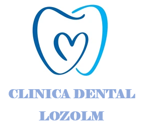

<h1>Documento resumen del proyecto para crear una Landing Page de una clínica dental</h1>
<ol>

<li><h2>Resumen del proyecto</h2>
</li>

Este proyecto consistirá en la creación de una Landing Page para una clínica dental. Esta Landing Page contendrá una descripción de la clínica dental, como un breve resumen sobre lo que hacen, sus tratamientos, su equipo y como contactar con ellos. El objetivo de este proyecto es familiarizarse con el uso de SCSS para aplicarlo en diferentes proyectos. 

<li><h2>Páginas web similares</h2></li>

 Se han encontrado diversas clínicas dentales con páginas web bien estructuradas como:

<ul>
<li>https://www.clinicadentalmoreda.com/</li>
<li>https://galvan.es/</li>
<li>https://www.dentalexvalladolid.es/</li>
<li>https://ortoinvisible.es/</li>
</ul>

<li><h2>Tecnologías utilizadas</h2></li>
Se utilizaran solamente HTML, Javascript y SCSS.

<li><h2>Bocetos de la página web</h2></li>

Se han realizado bocetos con Figma de como se espera que sea el resultado final. Aún así se permiten variaciones sobre estos bocetos ya que estos bocetos solo sirven como una idea general. Si se detectan mejoras mientras se realiza el código, se pueden aplicar sin problema. Estos bocetos se encuentran en el pdf adjunto clinica-lozolm-bocetos. 

<li><h2>Detalles de la aplicación</h2></li>
<ul>
<li>Icono:</li>

<li>Colores:</li>
<ul>
<li>Azul claro: #09E2EC</li>
<li>Azul oscuro: #2B62F3</li>
</ul>
</ul>

<li><h2>Registro del tiempo</h2></li>
<table>
<tr>
    <th>Fecha</th>
    <th>Hora de inicio</th>
    <th>Hora final</th>
    <th>Tiempo utilizado (en minutos)</th>
    <th>Descripción del trabajo realizado</th>
  </tr>

  <tr>
    <td>Lunes 1 de mayo</td>
    <td>8:45</td>
    <td>11:20</td>
    <td>155</td>
    <td>Documento resumen</td>
  </tr>

   <tr>
    <td>Lunes 1 de mayo</td>
    <td>11:40</td>
    <td>14:30</td>
    <td>170</td>
    <td>Desarrollo primera parte</td>
  </tr>

  <tr>
    <td>Lunes 1 de mayo</td>
    <td>19:05</td>
    <td>19:55</td>
    <td>50</td>
    <td>Desarrollo primera parte</td>
  </tr>

   <tr>
    <td>Lunes 1 de mayo</td>
    <td>21:25</td>
    <td>21:55</td>
    <td>30</td>
    <td>Desarrollo</td>
  </tr>

   <tr>
    <td>Lunes 1 de mayo</td>
    <td>22:30</td>
    <td>23:55</td>
    <td>85</td>
    <td>Desarrollo</td>
  </tr>

  <tr>
    <td>Viernes 12 de mayo</td>
    <td>12:40</td>
    <td>13:20</td>
    <td>30</td>
    <td>Cierre</td>
  </tr>
</table>

<h3><strong>Tiempo total dedicado:520 minutos (8 horas y 40 minutos) </strong></h3>

<li><h2>Resultado final</h2></li>

Repositorio Github: https://github.com/chemiya/PR-18-ClinicaLozOlm.git

Video Youtube: https://www.youtube.com/watch?v=1ST3UCwVQlI 

    
<li><h2>Conclusiones</h2></li>

He aprendido los pilares fundamentales de SCSS y he visto las ventajas que ofrece para dar estilos a una página web. He comprobado que facilita el desarrollo de los estilos de una página web y que tiene muchas ventajas sobre CSS.

</ol>
